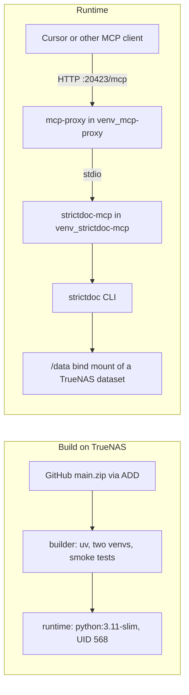

# TrueNAS compose file with inline Dockerfile built from the public zip

## Findings that shape the design
- GitHub `main` (commit `83ecaf7`, which is the zip's contents) leaves `mcp` unpinned and still uses `@app.list_tools()`. PyPI now serves mcp 2.3.0, which removed those decorators, so an image built from today's zip installs cleanly but crashes on import. The fix exists only as uncommitted edits to [pyproject.toml](pyproject.toml), [src/strictdoc_mcp/server.py](src/strictdoc_mcp/server.py), and [tests/diagnostic/verify_server.py](tests/diagnostic/verify_server.py). It must be pushed first.
- `mcp-proxy` 0.12.0 registers handlers through `app.request_handlers[types.ListToolsRequest]`, and both of those are gone in mcp 2.3.0. It therefore gets its own virtualenv constrained to `mcp<2`, and it launches `strictdoc-mcp` as a stdio subprocess. The handshake works: mcp 1.30 speaks protocol `2025-11-25`, which mcp 2.3.0 accepts.
- TrueNAS "Install via YAML" officially supports `dockerfile_inline`. Every `$` that belongs to the Dockerfile must be written as `$$`, because Compose interpolates the inline text (TrueNAS's own example does this).
- GitHub's zip endpoint returns an `ETag`, so `ADD <url>` re-downloads only when `main` changes. Combined with `pull_policy: build`, a restart with no new commits is a quick cache hit.



## Your decisions, applied
- Commit and push the MCP 2.x migration first, as one commit (the three files depend on each other).
- HTTP bridge: `mcp-proxy==0.12.0` (overridable build arg) listening on container port 20423, the project's existing `PORT` from the [Makefile](Makefile). The host port is `${STRICTDOC_MCP_PORT:-20423}`. It has no authentication, so anyone on the LAN can reach it.
- Storage: a bind mount from `${STRICTDOC_MCP_DATA_PATH:-/mnt/tank/strictdoc}` to `/data` with `create_host_path: false`, so a wrong path fails loudly instead of creating a stray directory. `/data` is also the working directory and the parent of `STRICTDOC_MCP_DEFAULT_OUTPUT_DIR=/data/output`.
- User 568:568 (TrueNAS `apps`), overridable via the `APP_UID` and `APP_GID` build args.
- `pull_policy: build`, so every app start or redeploy rebuilds. The app cannot start while GitHub is unreachable.
- Source is `STRICTDOC_MCP_ZIP_URL`, defaulting to `main.zip`. Any tag or commit zip also works.
- Dependencies float as `pyproject.toml` allows. Build-time import checks fail the build rather than ship an image that crashes on startup.
- uv from the pinned `ghcr.io/astral-sh/uv:0.12.23` image, installing into `/app/venv_strictdoc-mcp` and `/app/venv_mcp-proxy`. Base image is `python:3.11-slim`.
- Healthcheck: import `strictdoc_mcp.server`, run `strictdoc version`, and also GET `http://127.0.0.1:20423/status`. That third check goes beyond your choice. I added it because with the bridge, the container could otherwise show healthy while the endpoint is down. Interval 30s, timeout 10s, 3 retries, start period 40s.
- No web UI port and no Chromium. The only other change is a [.dockerignore](.dockerignore) entry; the README and Makefile stay as they are.
- Additions you didn't ask for, following TrueNAS and `.cursor/rules` conventions: `restart: unless-stopped`, `security_opt: no-new-privileges:true`, `cap_drop: [ALL]`, a named `strictdoc-mcp-http` bridge network, image tag `strictdoc-mcp:main` instead of `latest`, no obsolete `version:` key, and `/app/SOURCE_COMMIT` (the zip comment holds the commit SHA) so you can tell which commit is running.

## Core of [docker-compose-TrueNAS.yml](docker-compose-TrueNAS.yml)
A short header comment covers the TrueNAS steps (Apps, Discover, the three-dot menu, Install via YAML; edit the path default; dataset writable by 568), the variables, and the client URL `http://<nas>:20423/mcp`.

```yaml
services:
  strictdoc-mcp:
    build:
      args:
        STRICTDOC_MCP_ZIP_URL: ${STRICTDOC_MCP_ZIP_URL:-https://github.com/dapperfu/strictdoc-mcp/archive/refs/heads/main.zip}
        MCP_PROXY_VERSION: ${MCP_PROXY_VERSION:-0.12.0}
        APP_UID: ${APP_UID:-568}
        APP_GID: ${APP_GID:-568}
      dockerfile_inline: |
        FROM python:3.11-slim AS builder
        COPY --from=ghcr.io/astral-sh/uv:0.12.23 /uv /usr/local/bin/uv
        ENV UV_PYTHON_DOWNLOADS=never UV_COMPILE_BYTECODE=1 UV_LINK_MODE=copy UV_NO_CACHE=1
        ARG MCP_PROXY_VERSION
        RUN uv venv /app/venv_mcp-proxy
        # mcp-proxy 0.12.0 uses the mcp 1.x handler API
        RUN uv pip install --python /app/venv_mcp-proxy/bin/python "mcp-proxy==$${MCP_PROXY_VERSION}" "mcp<2"
        RUN /app/venv_mcp-proxy/bin/mcp-proxy --version
        ARG STRICTDOC_MCP_ZIP_URL
        ADD $${STRICTDOC_MCP_ZIP_URL} /tmp/strictdoc-mcp.zip
        RUN python -m zipfile -e /tmp/strictdoc-mcp.zip /tmp/src
        RUN python -c "import zipfile; print(zipfile.ZipFile('/tmp/strictdoc-mcp.zip').comment.decode())" > /app/SOURCE_COMMIT
        RUN uv venv /app/venv_strictdoc-mcp
        RUN uv pip install --python /app/venv_strictdoc-mcp/bin/python /tmp/src/*/
        RUN /app/venv_strictdoc-mcp/bin/python -c "import strictdoc_mcp.server"

        FROM python:3.11-slim
        ARG APP_UID
        ARG APP_GID
        RUN groupadd --gid "$${APP_GID}" appuser
        RUN useradd --uid "$${APP_UID}" --gid "$${APP_GID}" --create-home appuser
        COPY --from=builder /app /app
        ENV PATH="/app/venv_strictdoc-mcp/bin:/app/venv_mcp-proxy/bin:$${PATH}"
        WORKDIR /data
        USER appuser
        EXPOSE 20423
        ENTRYPOINT ["mcp-proxy", "--host", "0.0.0.0", "--port", "20423", "--pass-environment", "--", "strictdoc-mcp"]
    image: strictdoc-mcp:main
    pull_policy: build
    # plus: container_name, restart, ports, environment, volumes (bind, create_host_path false),
    # healthcheck, security_opt, cap_drop, networks as listed above
```

`--pass-environment` is required. Without it, the `STRICTDOC_MCP_*` variables never reach the child server.

## Execution order (commit and push after each step, per `.cursor/rules`)
1. Save this plan to `plans/truenas-compose-inline-dockerfile.md`. Set the git `user.name` and `user.email` the rules require. There is no `upstream` remote, so `git fetch origin` only. Commit and push.
2. Before pushing the MCP 2.x migration, check it: build the existing [Dockerfile](Dockerfile) and pipe an `initialize`, `notifications/initialized`, `tools/list` sequence into `docker run -i`, expecting 8 tools. Then commit the three files with the plan checkoff and push to `origin/main`. Leave the tracked `.pyc` files and the `.cursor/rules` submodule pointer uncommitted.
3. Write the compose file, then verify it locally before committing:
   - `docker compose -f docker-compose-TrueNAS.yml config --quiet`
   - Pre-check that nothing else holds container name `strictdoc-mcp` or port 20423 (the existing `docker-compose.yml` uses the same container name). If something does, stop and ask.
   - Build from the GitHub zip, then run with `STRICTDOC_MCP_DATA_PATH` pointing at a temporary directory with mode 0777 (no sudo or chown). Wait for `healthy`.
   - Using curl against `/mcp`: send `initialize`, read the `mcp-session-id`, then call `tools/list` (expect 8 tools) and `tools/call strictdoc_version`.
   - Confirm `/app/SOURCE_COMMIT` matches the SHA pushed in step 2, and that a second build is fully cached.
   - Tear down with `docker compose ... down --rmi all`, then commit and push.
4. Add `docker-compose-TrueNAS.yml` under "Docker files" in [.dockerignore](.dockerignore). Commit and push.

## Risks
- Pushing over SSH (`git@github.com:dapperfu/strictdoc-mcp.git`) needs a working key. If the push fails, the TrueNAS build keeps getting the broken `main`, and I'll stop and report.
- If the `mcp-proxy` bridge fails the end-to-end check, the fallback is native streamable HTTP in `server.py`. That's a code change, so I'd check with you before doing it.